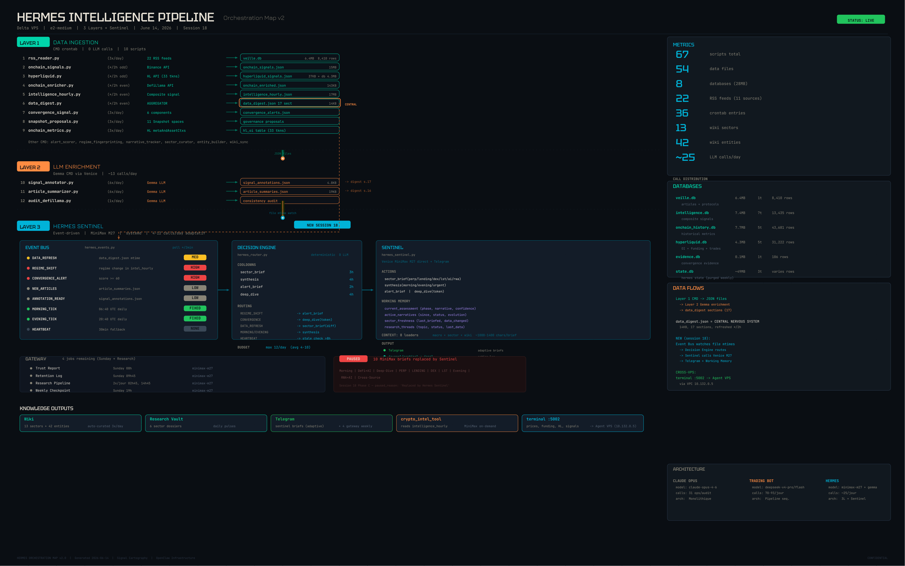

# Hermes Intelligence Terminal

> Real-time crypto intelligence dashboard powered by a 3-layer autonomous pipeline on GCP.

**Live** → [johnpreston2.github.io/hermes-dashboard](https://johnpreston2.github.io/hermes-dashboard/)

---

## Architecture

Hermes runs on a dedicated GCP e2-medium VPS (Delta) with 3 processing layers:

| Layer | Engine | Calls/day | Role |
|---|---|---|---|
| **Data Ingestion** | CMD crontab | 0 LLM | 10 scripts: RSS (22 feeds), on-chain signals, Hyperliquid (33 tokens), DefiLlama, composite signals, convergence, governance |
| **LLM Enrichment** | Gemma via Venice | ~13 | Signal annotation, article summarization, DeFi audits |
| **Intelligence Synthesis** | Hermes Sentinel | ~10 adaptive | Event-driven briefs across 6 sectors (perp, lending, dex, lst, ai, rwa) |

### Sentinel (Layer 3)

Replaced 10 fixed-schedule MiniMax briefs with a single event-driven process:

- **Event Bus** — polls file changes every 2min (data refresh, regime shifts, convergence alerts)
- **Decision Engine** — deterministic routing with cooldowns (3h sector, 4h synthesis, 2h alert)
- **Working Memory** — persistent narratives, sector freshness, market assessment across briefs
- **Venice MiniMax M27** — direct API calls, no gateway overhead

### Data

- **8 databases** (28MB, 96K rows) — articles, composite signals, on-chain history, Hyperliquid OI/funding
- **54 data files** — central nervous system via `data_digest.json` (17 sections)
- **13 wiki sectors + 42 entities** — auto-curated knowledge base

## Dashboard

The terminal displays:
- **Token scores** — multi-source composite scoring with historical tracking
- **Signal analysis** — V2 evaluated signals with confidence and horizon
- **Bias tracking** — LONG/SHORT/NEUTRAL regime with conviction history
- **Sector intelligence** — DeFi sectors with TVL, yields, and anomaly detection

Data auto-refreshes every hour via GitHub Pages.

## Cross-VPS Intelligence

Hermes feeds the trading agent (Agent VPS) via internal VPC:
- `terminal :5002` → prices, funding rates, HL data, composite signals
- `/api/intelligence` → token tier (A/B/C), composite regime, IC-weighted scores

---

*Built with Claude Code across 19 sessions. No frameworks, no dependencies — pure Python + vanilla JS.*
